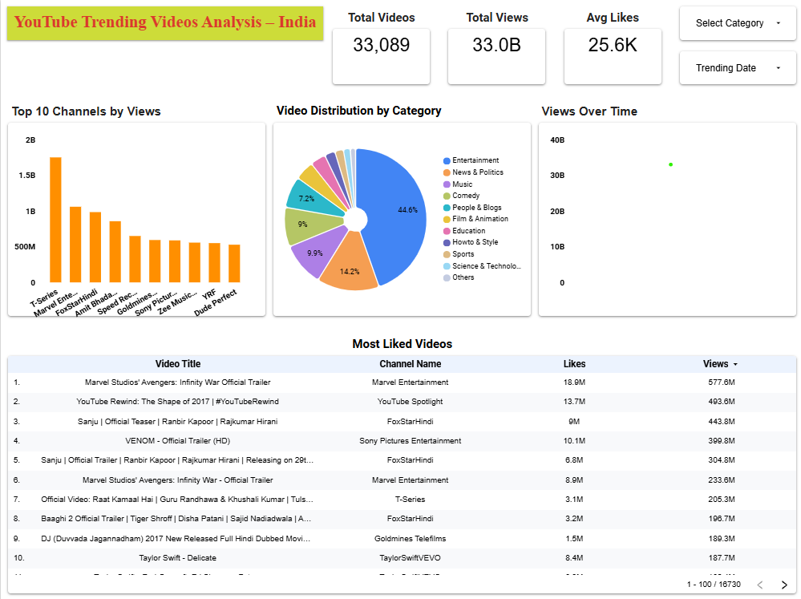

# YouTube Trending India Dashboard

An interactive Looker Studio dashboard analyzing trending YouTube videos in India.  
The project explores video categories, viewership trends, engagement patterns, and key performance metrics.

---

## 📊 Dashboard Link
[🔗 View Live Dashboard](https://lookerstudio.google.com/reporting/6618fa8a-7a4c-4a1c-969f-f68a7e512f42)  

---

## 📂 Dataset
The dataset contains trending YouTube video records for India, including views, likes, comments, and category details.  
It is publicly hosted on Google Drive:  
[📥 Download INvideos.csv](https://drive.google.com/file/d/170-KR0d_xoj2tG9rXkRV68aBGLh0EPuZ/view?usp=sharing)  

---

## 🔍 Key Insights
- **Most Popular Categories** – Identifies which video categories dominate the trending list.
- **Top Performing Videos** – Highlights videos with exceptional engagement rates.
- **Engagement Patterns** – Compares likes, dislikes, and comments across categories.
- **Time-based Trends** – Analyzes changes in views and popularity over time.

---

## 🛠 Tools & Technologies
- **Data Visualization**: Google Looker Studio
- **Data Source**: Kaggle (YouTube Trending Video Dataset)
- **Data Cleaning**: Microsoft Excel / Google Sheets

---

## 📷 Dashboard Preview

---

## 📜 How to Use This Repository
1. View the dashboard directly via the link above.
2. Download the dataset from Google Drive if you want to replicate the analysis.
3. Open the `.csv` in Excel, Sheets, or any BI tool for your own exploration.

---

## 📌 Author
**Venu Gopal**  
[GitHub Profile](https://github.com/Venugopal9578)
